# DIU23
Prácticas Diseño Interfaces de Usuario 2022-23 (Tema: Tablao Flamenco - La Arboleá ) 

Grupo: DIU1_01LosTardíos.  Curso: 2022/23 
Updated: 19/05/2023

Proyecto: 
>>> Rediseño de La Arboleá

Descripción: 

>>> Nos hemos propuesto llevar a cabo un rediseño de nuestra página web actual con el objetivo de mejorar su desempeño y lograr una mayor visibilidad entre nuestro público objetivo. Aunque nuestra web ya es reconocida en el sector, es cierto que presenta algunas limitaciones que creemos que podrían ser mejoradas sin tener que partir de cero.
En lugar de desechar todo el trabajo previo, nuestra idea es perfeccionar algunos aspectos clave para potenciar aún más nuestra presencia en línea. De esta forma, nos aseguramos de mantener la esencia de nuestra marca y su carácter distintivo, mientras introducimos nuevas funcionalidades y elementos que la harán más atractiva y accesible para nuestros clientes.
El enfoque principal de este rediseño es mejorar la experiencia de usuario, por lo que nos hemos enfocado en aspectos como la navegación, la usabilidad, el diseño y la optimización para dispositivos móviles. En este sentido, estamos trabajando en una nueva estructura de contenidos que facilite la búsqueda de información relevante y en una interfaz más intuitiva que permita a los usuarios encontrar lo que necesitan de manera rápida y sencilla.

Logotipo: 
>>> 
>>> 
>>> 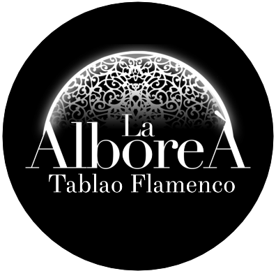
>>> 
>>> Hemos decidido mantener el mismo logo puesto que creemos que es llamativo, representativo del sitio y muy visual. Además desde el punto de vista del marketing creemos que es beneficioso mantener el logo de un tablao que se ha creado un nombre dentro del mundillo del arte flamenco.
>>> Además, hemos decidido explotar la vía del actual logo. También lo utilizaremos de logos pero de forma más simple y sencilla, sin colores más allá del blanco y negro. Creemos que es una forma significativa de que las personas recuerden con facilidad nuestra seña de identidad. Cualquier cliente o posible cliente que vea el logo, siempre lo asociará a nuestro proyecto.
Aparte, este tipo de logos en redes sociales (vía que pensamos aprovechar) tienen buena acogida entre el público, puesto que son minimalistas, claros y simples.

Miembros
 * :bust_in_silhouette:   Marco Antonio Rodríguez Molina
    :octocat:     
 * :bust_in_silhouette:  Guillermo Romacho López     :octocat:

----- 

# Proceso de Diseño 

## Paso 1. UX Desk Research & Analisis 

 1.a Competitive Analysis
-----
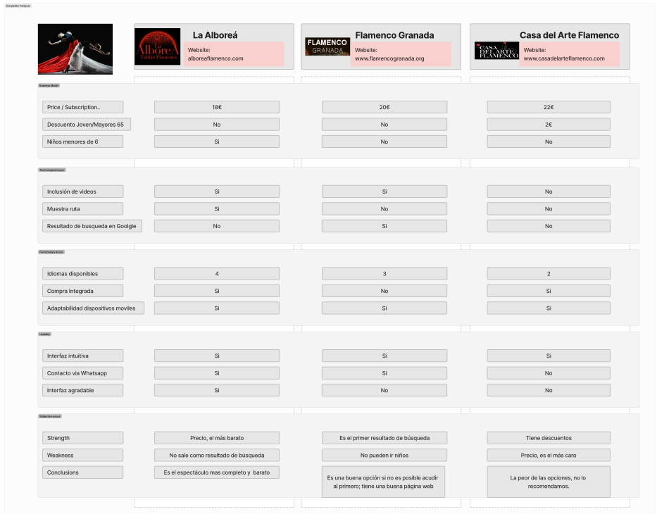 

>>> Para hacer el análisis hemos tenido en cuenta otras dos webs similares, las cuales ofertan el mismo tipo de evento, así podríamos comparar de forma más exhaustiva. Al final, consideramos que la elegida debe ser La Alboreá, porque en el cómputo global es la que más destaca, además es la más accesible a cualquier usuario. 

 1.b Persona
-----
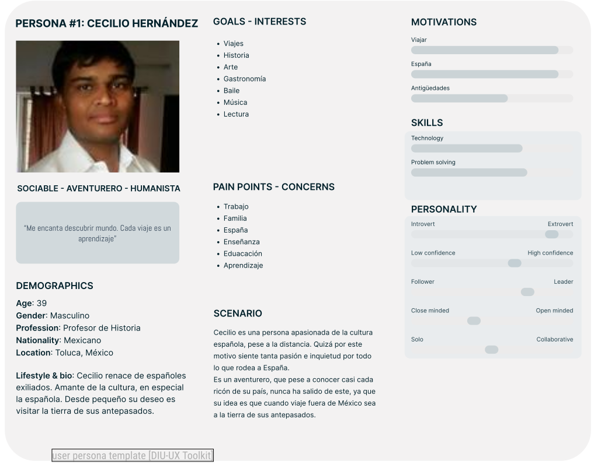
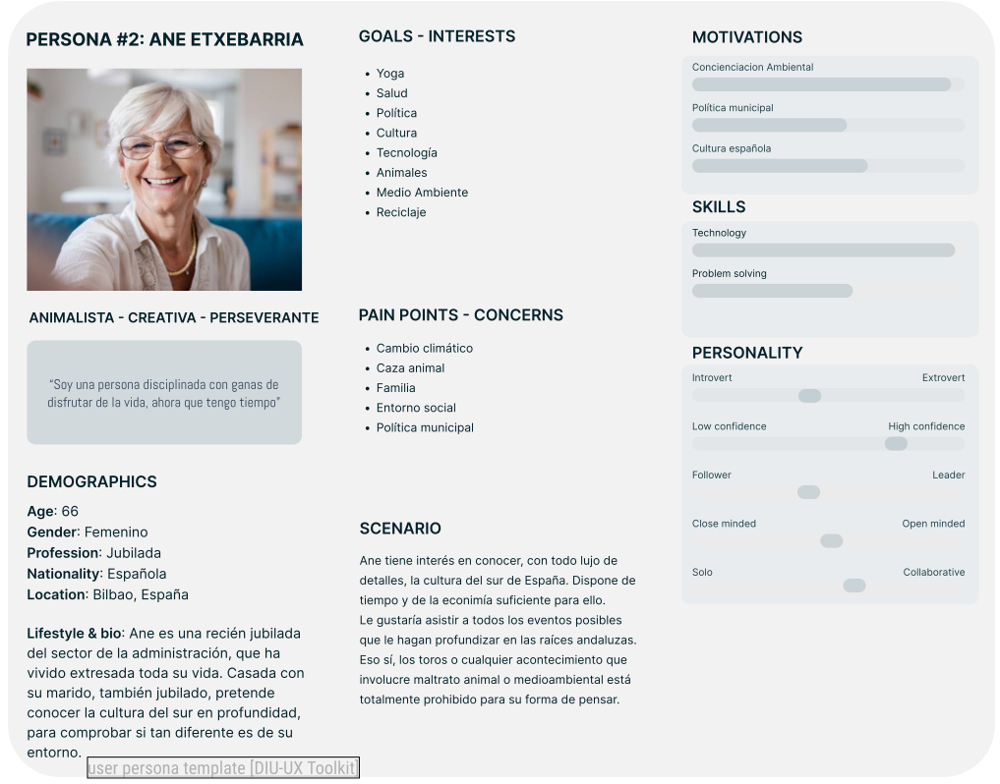
>>> Las personas elegidas, son potenciales usuarios de la web y de los eventos que se promocionan en la misma. Aunque también se ha intentado que sean lo más creíbles posibles para que pudiese ser la más semejante a una experiencia real. Por eso, hemos incluido un poco de contexto de cada persona además de algunos puntos (tanto positivos como negativos) que se salían del escenario pedido en la práctica. Por ejemplo, Ane le preocupa la política municipal y la caza animal, que poco tiene que ver con el evento y/o la web que abordamos, no obstante le da empaque.

 1.c User Journey Map
----
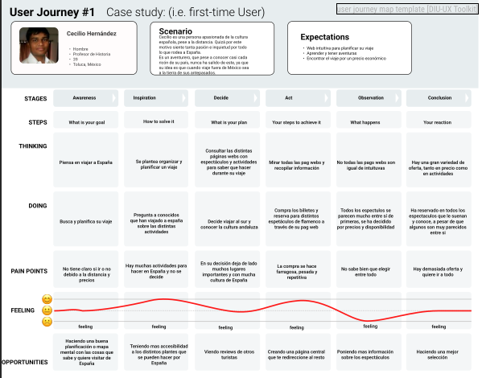
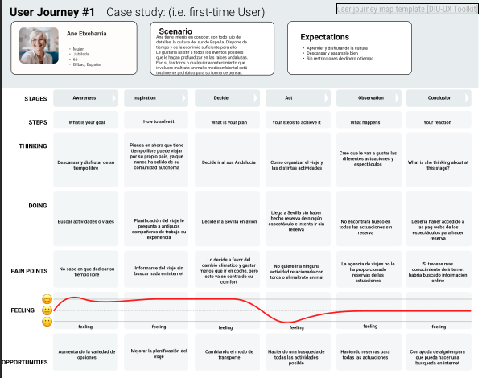

>>> Las diferentes motivaciones de Ane y Cecilio para viajar influyen en la organización de su itinerario: Ane busca diversión y flexibilidad, mientras que Cecilio tiene un plan más estructurado y enfocado en cumplir su sueño. 

 1.d Usability Review
----

>>> - Enlace al documento:  [Usability Review](P1/m_usability_review.xls)
>>> - Valoración final (numérica): 69 (good)
>>> - Comentario sobre la valoración: Es una web muy accesible y que se preocupa por el usuario, pero que tiene aspectos a mejorar de forma sencilla. Entiendo que si no lo hacen es por una mera cuestión estética y gusto personal, quizá no presente demasiada importancia, aunque a nosotros nos ha sorprendido.

## Paso 2. UX Design  

 2.a Feedback Capture Grid / EMpathy map / POV
----
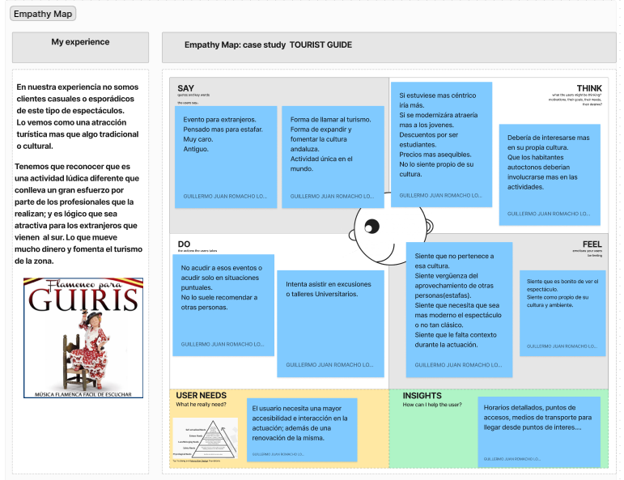 
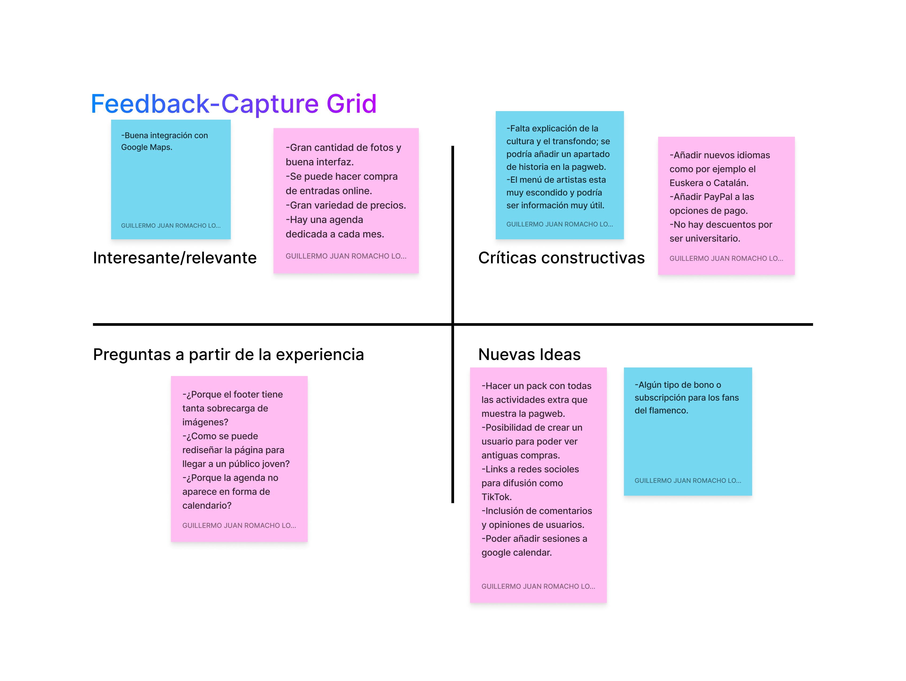 
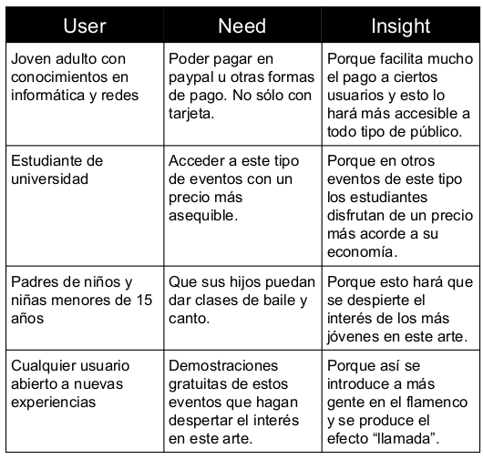 
    
>>> Nuestra estrategia de rediseño busca potenciar los puntos fuertes de nuestra página web actual, al mismo tiempo que corregimos aquellas áreas en las que podemos mejorar. Creemos que este enfoque nos permitirá seguir siendo una referencia en nuestro sector y llegar a un mayor número de clientes potenciales de manera efectiva.

 2.b ScopeCanvas
----

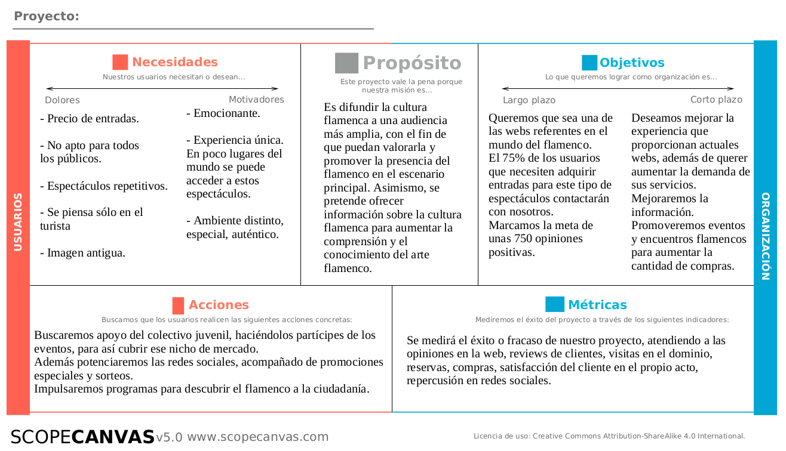 

 2.b Tasks analysis 
-----

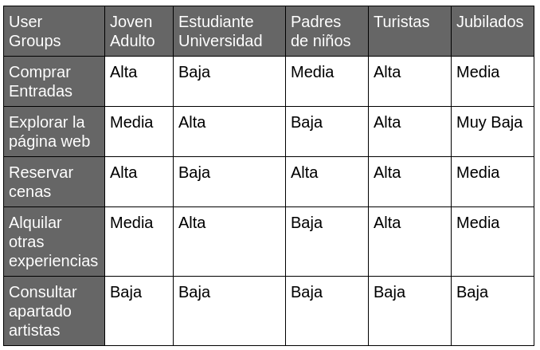 

 2.c IA: Sitemap + Labelling 
----

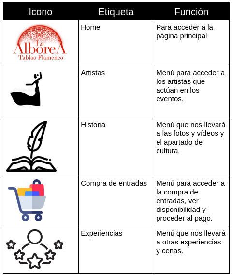 

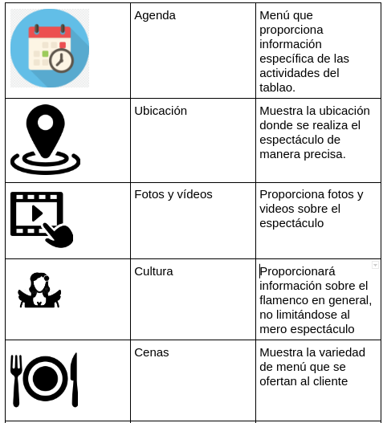 

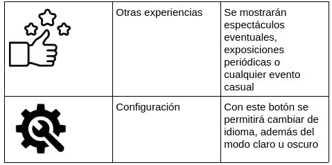 

 2.d Wireframes
-----

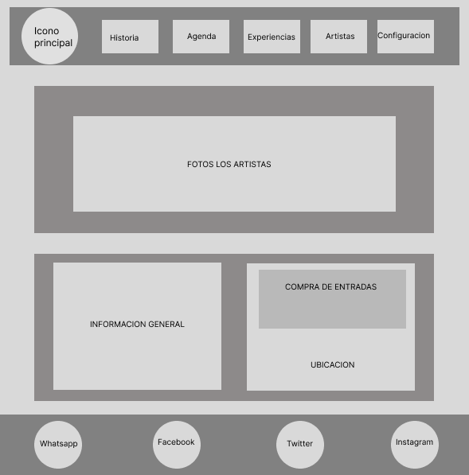

Boceto de la página principal

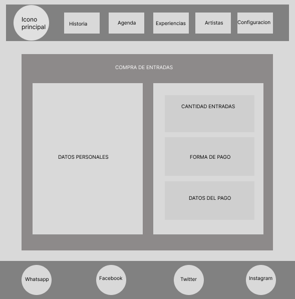

Boceto de la página entradas

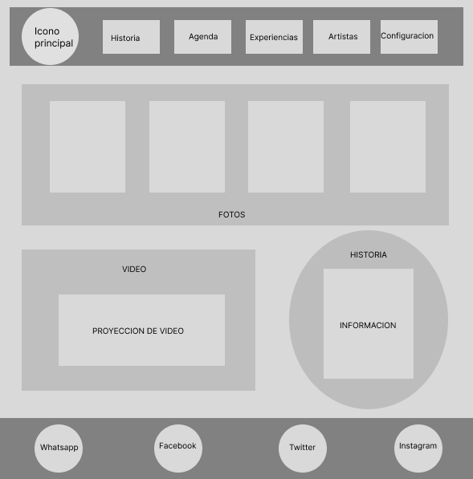

Boceto de la página historia

## Paso 3. Mi UX-Case Study (diseño)

 3.a Moodboard
-----

>>> Plantear Diseño visual con una guía de estilos visual (moodboard) 
>>> Incluir Logotipo
>>> Si diseña un logotipo, explique la herramienta utilizada y la resolución empleada. ¿Puede usar esta imagen como cabecera de Twitter, por ejemplo, o necesita otra?

  3.b Landing Page
----

>>> Plantear Landing Page 

 3.c Guidelines
----

>>> Estudio de Guidelines y Patrones IU a usar 
>>> Tras documentarse, muestre las deciones tomadas sobre Patrones IU a usar para la fase siguiente de prototipado. 

  3.d Mockup
----

>>> Layout: Mockup / prototipo HTML  (que permita simular tareas con estilo de IU seleccionado)

 3.e ¿My UX-Case Study?
-----

>>> Publicar my Case Study en Github..
>>> Documente y resuma el diseño de su producto en forma de video de 90 segundos aprox

## Paso 4. Evaluación 

 4.a Caso asignado
----

>>> Breve descripción del caso asignado con enlace a  su repositorio Github

 4.b User Testing
----

>>> Seleccione 4 personas ficticias. Exprese las ideas de posibles situaciones conflictivas de esa persona en las propuestas evaluadas. Asigne dos a Caso A y 2 al caso B
 

| Usuarios | Sexo/Edad     | Ocupación   |  Exp.TIC    | Personalidad | Plataforma | TestA/B
| ------------- | -------- | ----------- | ----------- | -----------  | ---------- | ----
| User1's name  | H / 18   | Estudiante  | Media       | Introvertido | Web.       | A 
| User2's name  | H / 18   | Estudiante  | Media       | Timido       | Web        | A 
| User3's name  | M / 35   | Abogado     | Baja        | Emocional    | móvil      | B 
| User4's name  | H / 18   | Estudiante  | Media       | Racional     | Web        | B 

. 4.c Cuestionario SUS
----

>>> Usaremos el **Cuestionario SUS** para valorar la satisfacción de cada usuario con el diseño (A/B) realizado. Para ello usamos la [hoja de cálculo](https://github.com/mgea/DIU19/blob/master/Cuestionario%20SUS%20DIU.xlsx) para calcular resultados sigiendo las pautas para usar la escala SUS e interpretar los resultados
http://usabilitygeek.com/how-to-use-the-system-usability-scale-sus-to-evaluate-the-usability-of-your-website/)
Para más información, consultar aquí sobre la [metodología SUS](https://cui.unige.ch/isi/icle-wiki/_media/ipm:test-suschapt.pdf)

>>> Adjuntar captura de imagen con los resultados + Valoración personal 

 4.d Usability Report
----

>> Añadir report de usabilidad para práctica B (la de los compañeros)

>>> Valoración personal 

>>> ## Paso 5. Evaluación de Accesibilidad  (no necesaria)

>>>   5.a Accesibility evaluation Report 
>>>> ----

>>> Indica qué pretendes evaluar (de accesibilidad) sobre qué APP y qué resultados has obtenido 

>>> 5.a) Evaluación de la Accesibilidad (con simuladores o verificación de WACG) 
>>> 5.b) Uso de simuladores de accesibilidad 

>>> (uso de tabla de datos, indicar herramientas usadas) 

>>> 5.c Breve resumen del estudio de accesibilidad (de práctica 1) y puntos fuertes y de mejora de los criterios de accesibilidad de tu diseño propuesto en Práctica 4.

## Conclusión final / Valoración de las prácticas

>>> (90-150 palabras) Opinión del proceso de desarrollo de diseño siguiendo metodología UX y valoración (positiva /negativa) de los resultados obtenidos  

