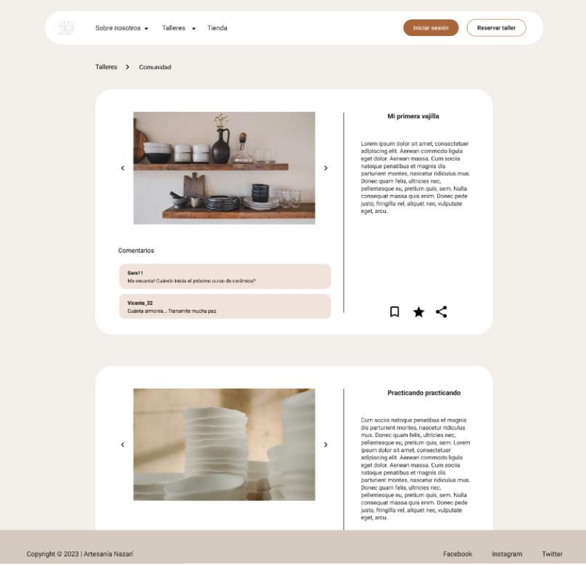

# DIU23
Prácticas Diseño Interfaces de Usuario 2022-23 (Tema: Tablao Flamenco - La Arboleá ) 

Grupo: DIU1_01LosTardíos.  Curso: 2022/23 
Updated: 19/05/2023

Proyecto: 
>>> Rediseño de La Arboleá

Descripción: 

>>> Nos hemos propuesto llevar a cabo un rediseño de nuestra página web actual con el objetivo de mejorar su desempeño y lograr una mayor visibilidad entre nuestro público objetivo. Aunque nuestra web ya es reconocida en el sector, es cierto que presenta algunas limitaciones que creemos que podrían ser mejoradas sin tener que partir de cero.
En lugar de desechar todo el trabajo previo, nuestra idea es perfeccionar algunos aspectos clave para potenciar aún más nuestra presencia en línea. De esta forma, nos aseguramos de mantener la esencia de nuestra marca y su carácter distintivo, mientras introducimos nuevas funcionalidades y elementos que la harán más atractiva y accesible para nuestros clientes.
El enfoque principal de este rediseño es mejorar la experiencia de usuario, por lo que nos hemos enfocado en aspectos como la navegación, la usabilidad, el diseño y la optimización para dispositivos móviles. En este sentido, estamos trabajando en una nueva estructura de contenidos que facilite la búsqueda de información relevante y en una interfaz más intuitiva que permita a los usuarios encontrar lo que necesitan de manera rápida y sencilla.

Logotipo: 
>>> 
>>> 
>>> 
>>> 
>>> Hemos decidido mantener el mismo logo puesto que creemos que es llamativo, representativo del sitio y muy visual. Además desde el punto de vista del marketing creemos que es beneficioso mantener el logo de un tablao que se ha creado un nombre dentro del mundillo del arte flamenco.
>>> Además, hemos decidido explotar la vía del actual logo. También lo utilizaremos de logos pero de forma más simple y sencilla, sin colores más allá del blanco y negro. Creemos que es una forma significativa de que las personas recuerden con facilidad nuestra seña de identidad. Cualquier cliente o posible cliente que vea el logo, siempre lo asociará a nuestro proyecto.
Aparte, este tipo de logos en redes sociales (vía que pensamos aprovechar) tienen buena acogida entre el público, puesto que son minimalistas, claros y simples.

Diseño: 
>>> 

Página principal

>>> 

Página entradas

>>> 

Página historia

Miembros
 * :bust_in_silhouette:   Marco Antonio Rodríguez Molina
    :octocat:     
 * :bust_in_silhouette:  Guillermo Romacho López     :octocat:

----- 

# Proceso de Diseño 

## Paso 1. UX Desk Research & Analisis 

 1.a Competitive Analysis
-----
 

>>> Para hacer el análisis hemos tenido en cuenta otras dos webs similares, las cuales ofertan el mismo tipo de evento, así podríamos comparar de forma más exhaustiva. Al final, consideramos que la elegida debe ser La Alboreá, porque en el cómputo global es la que más destaca, además es la más accesible a cualquier usuario. 

 1.b Persona
-----

>>> Las personas elegidas, son potenciales usuarios de la web y de los eventos que se promocionan en la misma. Aunque también se ha intentado que sean lo más creíbles posibles para que pudiese ser la más semejante a una experiencia real. Por eso, hemos incluido un poco de contexto de cada persona además de algunos puntos (tanto positivos como negativos) que se salían del escenario pedido en la práctica. Por ejemplo, Ane le preocupa la política municipal y la caza animal, que poco tiene que ver con el evento y/o la web que abordamos, no obstante le da empaque.

 1.c User Journey Map
----

>>> Las diferentes motivaciones de Ane y Cecilio para viajar influyen en la organización de su itinerario: Ane busca diversión y flexibilidad, mientras que Cecilio tiene un plan más estructurado y enfocado en cumplir su sueño. 

 1.d Usability Review
----

>>> - Enlace al documento:  [Usability Review](P1/m_usability_review.xls)
>>> - Valoración final (numérica): 69 (good)
>>> - Comentario sobre la valoración: Es una web muy accesible y que se preocupa por el usuario, pero que tiene aspectos a mejorar de forma sencilla. Entiendo que si no lo hacen es por una mera cuestión estética y gusto personal, quizá no presente demasiada importancia, aunque a nosotros nos ha sorprendido.

## Paso 2. UX Design  

 2.a Feedback Capture Grid / EMpathy map / POV
----
 
 
 
    
>>> Nuestra estrategia de rediseño busca potenciar los puntos fuertes de nuestra página web actual, al mismo tiempo que corregimos aquellas áreas en las que podemos mejorar. Creemos que este enfoque nos permitirá seguir siendo una referencia en nuestro sector y llegar a un mayor número de clientes potenciales de manera efectiva.

 2.b ScopeCanvas
----

 

 2.b Tasks analysis 
-----

 

 2.c IA: Sitemap + Labelling 
----

 

 

 

 2.d Wireframes
-----

Boceto de la página principal

Boceto de la página entradas

Boceto de la página historia

## Paso 3. Mi UX-Case Study (diseño)

 3.a Moodboard
-----

  3.b Landing Page
----

 3.c Guidelines
----

Teniendo en cuenta los patrones de diseño vistos en teoría nos hemos percatado de varias modificaciones que deberíamos llevar a cabo en nuestro proyecto con el fin de mejorar la experiencia del usuario.
- Debemos incluir (en nuestro apartado dedicado a los artistas en la página principal) un scroll para que se tenga acceso directo a todos y cada uno de los artistas de los que se dispone.
- Tarjetas: Un patrón utilizado para organizar y presentar información en un formato visualmente atractivo y fácil de escanear, ideal para mostrar productos, artículos o perfiles de usuarios.
- Formulario de búsqueda: Un patrón que proporciona a los usuarios un campo de búsqueda para buscar contenido dentro del sitio web.
- Poder filtrar comentarios de la página web.

Además también:

- Consistencia visual: Mantener una apariencia visual coherente en todo el sitio web, utilizando colores, tipografía y elementos visuales que reflejen la identidad de marca.
- Diseño receptivo (responsive design): Asegurarse de que la web se adapte y funcione correctamente en diferentes dispositivos y tamaños de pantalla.
- Usabilidad y accesibilidad: Seguir pautas de usabilidad y accesibilidad para garantizar que el sitio web sea fácil de usar y accesible para todos los usuarios, incluyendo aquellos con discapacidades.
- Jerarquía visual: Utilizar técnicas de diseño, como el uso de tamaños de fuente, espaciado y contraste, para destacar la información más importante y guiar la atención del usuario.
- Tiempos de carga rápidos: Optimizar el rendimiento del sitio web para que las páginas se carguen rápidamente y los usuarios no experimenten tiempos de espera largos.

Que aunque bien es cierto que son elementos e ideas básicos, no está mal recalcar y hacer especial hincapié en tenerlo en cuenta.

  3.d Mockup
----

>>> Layout: Mockup / prototipo HTML  (que permita simular tareas con estilo de IU seleccionado)

 3.e ¿My UX-Case Study?
-----

## Paso 4. Evaluación 

 4.a Caso asignado
----
Artesanía Nazarí (que se ha cambiado el nombre ahora a NazaLine). Quiere fomentar el sentimiento de comunidad por ello proponemos expandir ese concepto y solventar además un problema. Los usuarios normalmente quieren información acerca de los talleres, si les va a gustar, saber experiencias de otros usuarios etc. Quiere dar la posibilidad a los usuarios de expresar sus vivencias en los talleres, crearemos un entorno donde los usuarios puedan postear sus obras y opinar sobre los talleres y las artesanías que hagan. Además de crear grupos abiertos de talleres donde los usuarios de la comunidad puedan participar, conocerse y también abaratar el coste de los talleres.

Enlace al proyecto: https://github.com/DIU-Ahora-o-nunca/DIU

Podemos decir que el proyecto cumple con las expectativas puestas y los objetivos que se proponían. Aunque bien es cierto que tiene aspectos negativos:
- Ser demasiado minimalista nos hace evadirnos del verdadero propósito que no es otro que conocer mejor la artesanía nazarí. Aunque en principio es un acierto el relacionarlo con el minimalismo, quizás en exceso nos hace desconectar del objetivo.
- La paleta de colores es poco llamativa.
- La tipografía no evoca nada la cultura nazarí.

Pero es verdad que hemos tenido que ponernos muy exquisitos para encontrar algun detalle a mejorar, puesto que el trabajo es muy completo.

 4.b User Testing
----

>>> Seleccione 4 personas ficticias. Exprese las ideas de posibles situaciones conflictivas de esa persona en las propuestas evaluadas. Asigne dos a Caso A y 2 al caso B
 

| Usuarios | Sexo/Edad     | Ocupación   |  Exp.TIC    | Personalidad | Plataforma | TestA/B
| ------------- | -------- | ----------- | ----------- | -----------  | ---------- | ----
| User1's name  | H / 18   | Estudiante  | Media       | Introvertido | Web.       | A 
| User2's name  | H / 18   | Estudiante  | Media       | Timido       | Web        | A 
| User3's name  | M / 35   | Abogado     | Baja        | Emocional    | móvil      | B 
| User4's name  | H / 18   | Estudiante  | Media       | Racional     | Web        | B 

. 4.c Cuestionario SUS
----

>>> Usaremos el **Cuestionario SUS** para valorar la satisfacción de cada usuario con el diseño (A/B) realizado. Para ello usamos la [hoja de cálculo](https://github.com/mgea/DIU19/blob/master/Cuestionario%20SUS%20DIU.xlsx) para calcular resultados sigiendo las pautas para usar la escala SUS e interpretar los resultados
http://usabilitygeek.com/how-to-use-the-system-usability-scale-sus-to-evaluate-the-usability-of-your-website/)
Para más información, consultar aquí sobre la [metodología SUS](https://cui.unige.ch/isi/icle-wiki/_media/ipm:test-suschapt.pdf)

>>> Adjuntar captura de imagen con los resultados + Valoración personal 

 4.d Usability Report
----

>> Añadir report de usabilidad para práctica B (la de los compañeros)

>>> Valoración personal 

>>> ## Paso 5. Evaluación de Accesibilidad  (no necesaria)

>>>   5.a Accesibility evaluation Report 
>>>> ----

>>> Indica qué pretendes evaluar (de accesibilidad) sobre qué APP y qué resultados has obtenido 

>>> 5.a) Evaluación de la Accesibilidad (con simuladores o verificación de WACG) 
>>> 5.b) Uso de simuladores de accesibilidad 

>>> (uso de tabla de datos, indicar herramientas usadas) 

>>> 5.c Breve resumen del estudio de accesibilidad (de práctica 1) y puntos fuertes y de mejora de los criterios de accesibilidad de tu diseño propuesto en Práctica 4.

## Conclusión final / Valoración de las prácticas

>>> (90-150 palabras) Opinión del proceso de desarrollo de diseño siguiendo metodología UX y valoración (positiva /negativa) de los resultados obtenidos  

